# Compiler Design Lab

<div align="center">

**A complete implementation of core Compiler Design concepts in Python.**

*Covering all phases from Lexical Analysis to Advanced Parsing techniques.*

[](https://github.com/ShivamKSah/ShivamKSah-Compiler-Design-Lab)
[](https://github.com/ShivamKSah/ShivamKSah-Compiler-Design-Lab/commits/master)


</div>

---

## Table of Contents

- [Repository Structure](#repository-structure)
- [Lab 1 - Lexical Analyzer](#lab-1--lexical-analyzer)
- [Lab 2 - Regular Expression to NFA](#lab-2--regular-expression-to-nfa)
- [Lab 3 - NFA to DFA](#lab-3--nfa-to-dfa)
- [Lab 4 - Elimination of Ambiguity, Left Recursion and Left Factoring](#lab-4--elimination-of-ambiguity-left-recursion-and-left-factoring)
- [Lab 5 - FIRST and FOLLOW Sets](#lab-5--first-and-follow-sets)
- [Lab 6 - Predictive Parsing Table LL1](#lab-6--predictive-parsing-table-ll1)
- [Lab 7 - Shift Reduce Parsing SLR1](#lab-7--shift-reduce-parsing-slr1)
- [Lab 8 - LEADING and TRAILING Sets](#lab-8--leading-and-trailing-sets)
- [How to Run Any Lab](#how-to-run-any-lab)
- [Overall Compiler Flow](#overall-compiler-flow)

---

## Repository Structure

```text
COMPILER-DESIGN-LAB/
+-- Lab 1 Lexical analyzer/
|   +-- lexical.py
|   +-- Readme.md
+-- Lab 2 conversion from Regular Expression to NFA/
|   +-- Re_to_nfa.py
|   +-- Readme.md
+-- Lab 3 Conversion from NFA to DFA/
|   +-- Nfa_dfa.py
|   +-- Readme.md
+-- Lab 4 Elimation of Ambiguity, Left Recursion and Left Factoring/
|   +-- Lftrecursion.py
|   +-- Readme.md
+-- Lab 5 -FIRST AND FOLLOW computation/
|   +-- First-follow-func.py
|   +-- Readme.md
+-- Lab 6 Predictive Parsing Table/
|   +-- Parsetable.py
|   +-- Readme.md
+-- Lab 7 - Shift Reduce Parsing/
|   +-- Shiftreduce.py
|   +-- Readme.md
+-- Lab 8- Computation of LEADING AND TRAILING/
|   +-- lead&trailing.py
|   +-- Readme.md
+-- README.md
```

---

## Lab 1 - Lexical Analyzer

**File:** `lexical.py` | **Status:** Completed

The first phase of a compiler. It reads raw source code character by character and groups them into **tokens** (the smallest meaningful units). The implementation uses Python's `re` module to build a master regex from individual token patterns, then scans the input string in a single pass.

**What it recognizes:** Keywords, Identifiers, Integers, Floats, Operators, Delimiters, Strings, and Unknown tokens.

```mermaid
flowchart TD
    A[Raw Source Code] --> B[Compile Master Regex Pattern]
    B --> C[Run finditer over Source Code]
    C --> D{Match Found?}
    D -- Yes --> E{Token Type?}
    E -- WHITESPACE --> F[Skip / Ignore]
    F --> C
    E -- KEYWORD / IDENTIFIER / INTEGER / FLOAT / OPERATOR / DELIMITER / STRING --> G[Append Token Type + Value to Token List]
    G --> C
    E -- UNKNOWN --> H[Flag Unknown Token and Append]
    H --> C
    D -- No --> I[Return Final Token List]
    I --> J[Display Tokens in Table Format]
```

**Example:**

```
Input:  int x = 10 + y;
Output: KEYWORD(int)  IDENTIFIER(x)  OPERATOR(=)  INTEGER(10)  OPERATOR(+)  IDENTIFIER(y)  DELIMITER(;)
```

---

## Lab 2 - Regular Expression to NFA

**File:** `Re_to_nfa.py` | **Status:** Completed

Converts a Regular Expression into a **Non-deterministic Finite Automaton (NFA)** using **Thompson's Construction Algorithm**. The regex is first preprocessed to insert explicit concatenation operators, then parsed using a recursive descent parser that builds the NFA bottom-up.

**Supports:** Literals, Concatenation (`.`), Union (`|`), Kleene Star (`*`), One-or-More (`+`), Optional (`?`), and Parentheses.

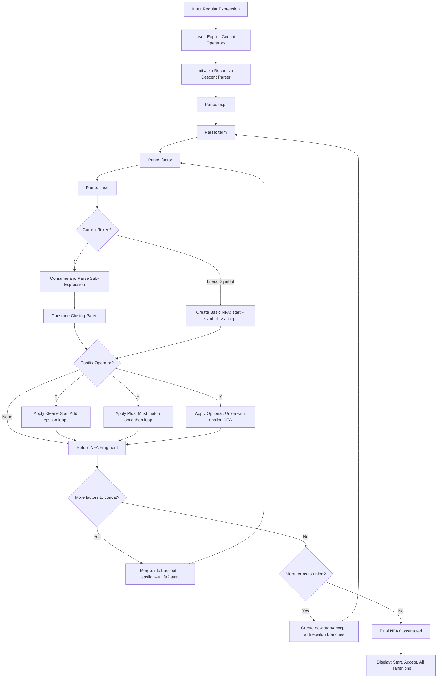

**Example:**

```
Regex: (a|b)*
NFA: q0 --epsilon--> q1 (branch a), q2 (branch b)
     q1 --a--> q3, q2 --b--> q4
     q3,q4 --epsilon--> accept, accept --epsilon--> q0 (loop)
```

---

## Lab 3 - NFA to DFA

**File:** `Nfa_dfa.py` | **Status:** Completed

Converts an NFA to an equivalent **Deterministic Finite Automaton (DFA)** using the **Subset Construction (Powerset) Algorithm**. Each DFA state corresponds to a set of NFA states. The resulting DFA is then used to simulate input string acceptance.

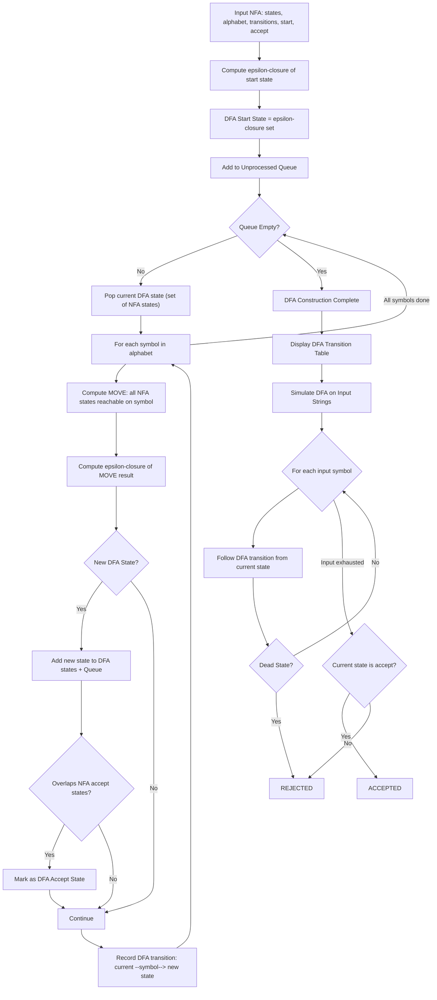

**Example:**

```
NFA for (a|b)*abb:
  DFA State {q0,q1,q3} on input 'a' --> DFA state {q1,q2}
  Input "abb" --> ACCEPTED
  Input "ab"  --> REJECTED
```

---

## Lab 4 - Elimination of Ambiguity, Left Recursion and Left Factoring

**File:** `Lftrecursion.py` | **Status:** Completed

Prepares a Context-Free Grammar (CFG) for predictive parsing by applying three essential grammar transformations. Each transformation addresses a different problem that prevents deterministic top-down parsing.

### Part 1: Left Recursion Elimination

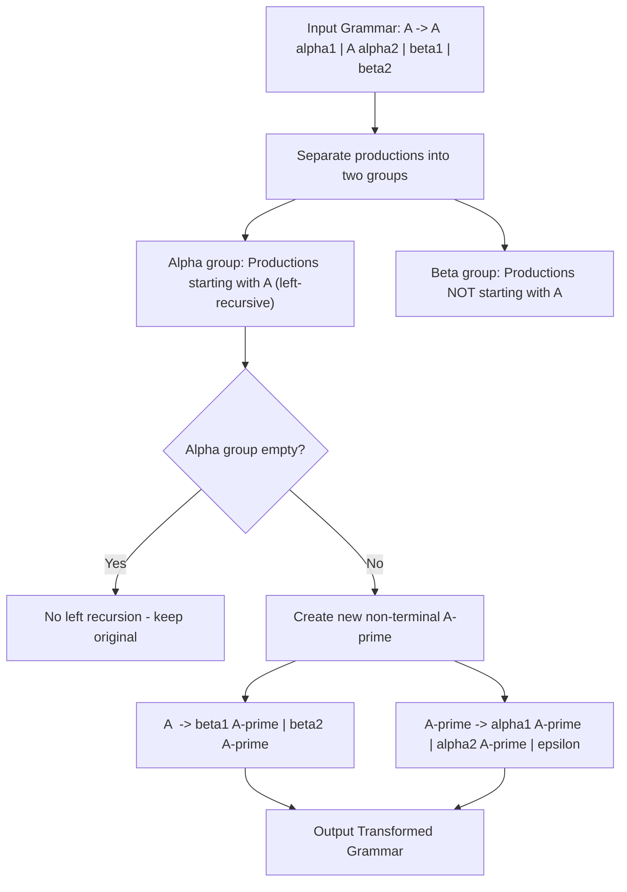

### Part 2: Left Factoring

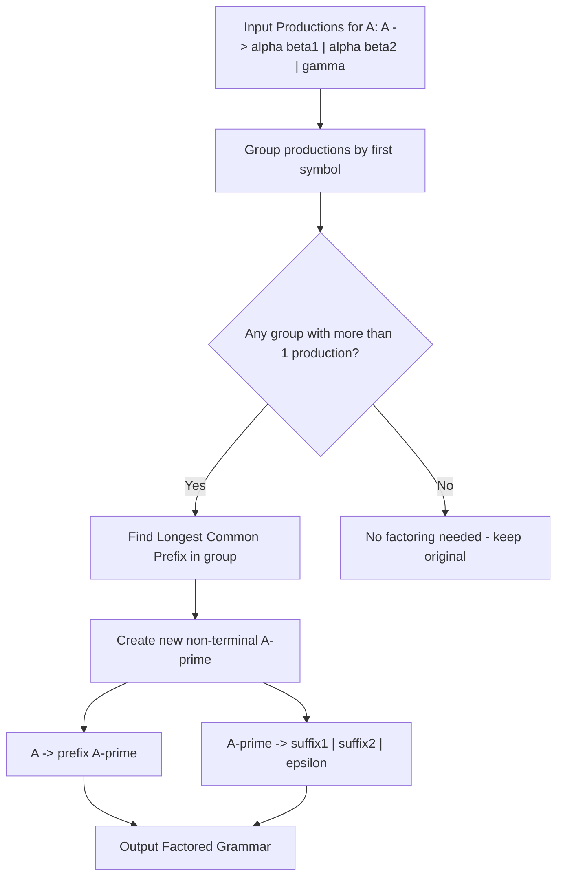

### Part 3: Ambiguity

The program demonstrates two classic examples of ambiguous grammars (Dangling-Else and Expression Grammar) and shows the unambiguous restructured versions with enforced precedence and associativity.

---

## Lab 5 - FIRST and FOLLOW Sets

**File:** `First-follow-func.py` | **Status:** Completed

Computes **FIRST** and **FOLLOW** sets for all non-terminals in a grammar using iterative fixed-point algorithms. These sets are essential for constructing LL(1) parsing tables.

### FIRST Set Computation

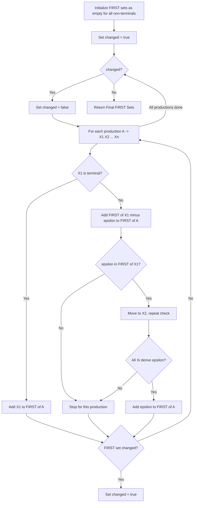

### FOLLOW Set Computation

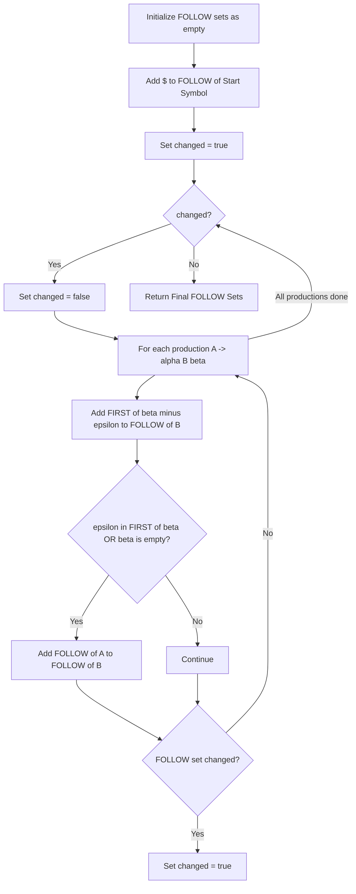

**Example Output:**

```
Non-Terminal    FIRST                  FOLLOW
E               { (, id }              { $, ) }
E'              { +, epsilon }         { $, ) }
T               { (, id }              { $, ), + }
```

---

## Lab 6 - Predictive Parsing Table (LL1)

**File:** `Parsetable.py` | **Status:** Completed

Constructs the **LL(1) Predictive Parsing Table** from FIRST and FOLLOW sets, then simulates stack-based top-down parsing with a step-by-step trace.

### Table Construction

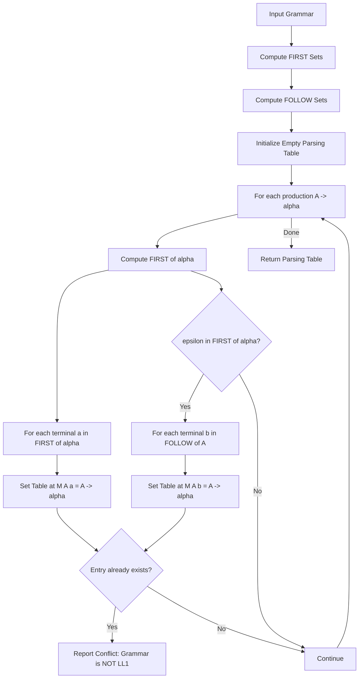

### Stack-Based LL(1) Parsing Simulation

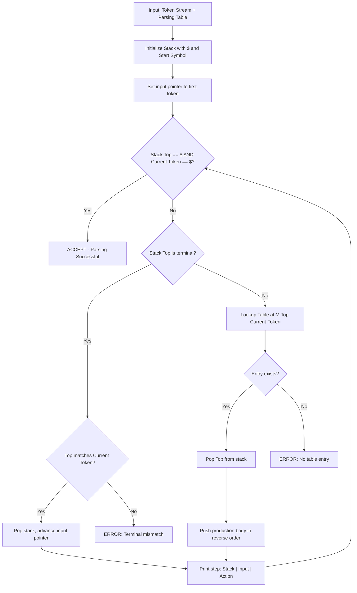

**Example Parsing Trace:**

```
STACK                       INPUT                ACTION
$ E' T E                    id + id * id $       E -> T E'
$ E' T' F T                 id + id * id $       T -> F T'
$ E' T' id F                id + id * id $       F -> id
...                                              ACCEPT
```

---

## Lab 7 - Shift Reduce Parsing (SLR1)

**File:** `Shiftreduce.py` | **Status:** Completed

Implements a full **SLR(1) Bottom-Up parser**. It augments the grammar, builds the LR(0) canonical collection of item sets, constructs the ACTION/GOTO tables using FOLLOW sets, and simulates shift-reduce parsing.

### LR(0) Automaton Construction

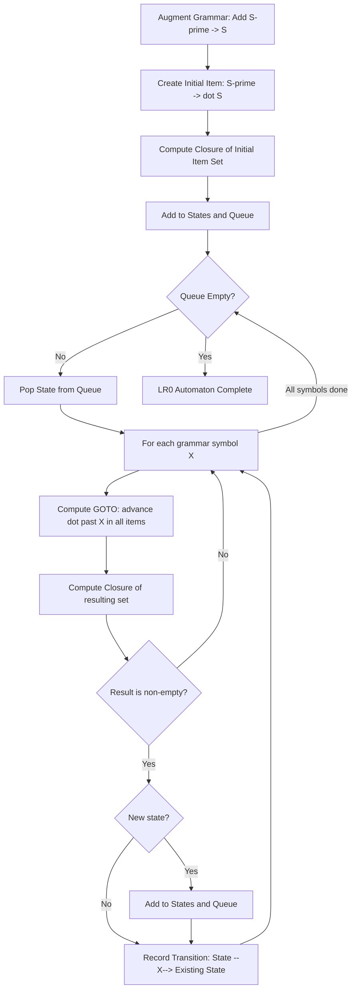

### SLR(1) Table Construction and Parsing

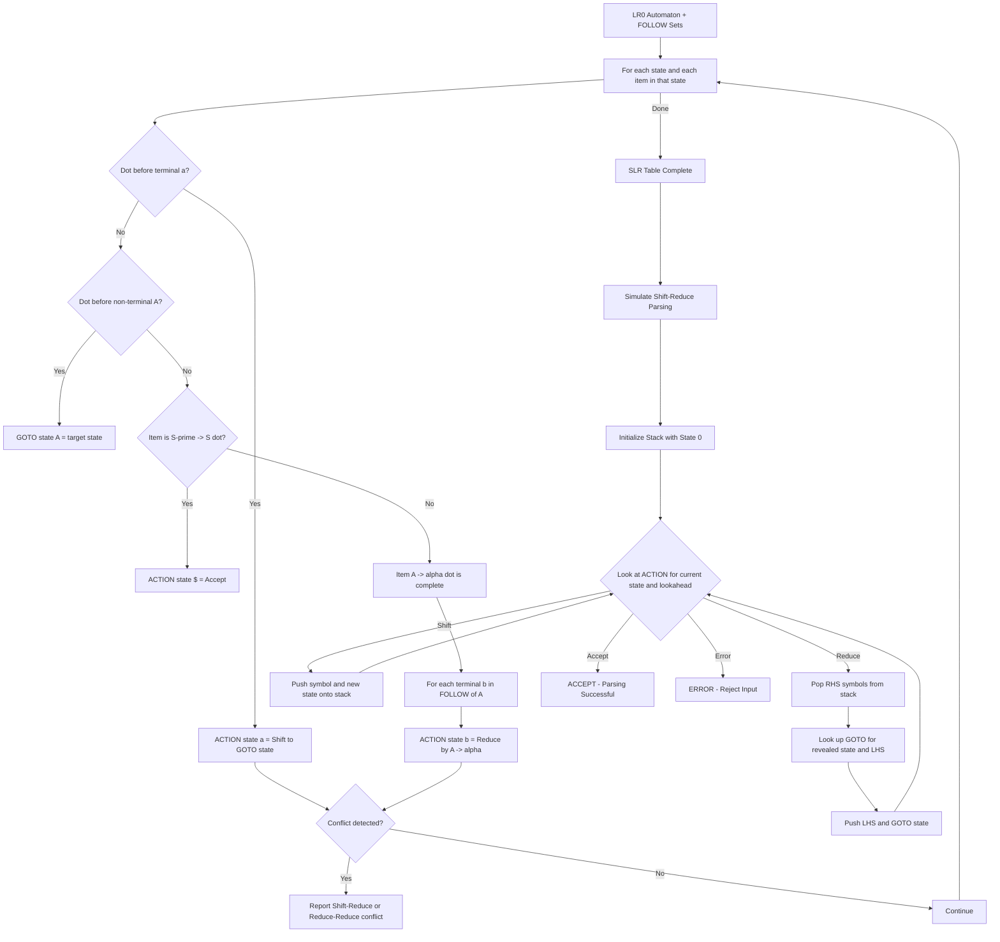

**Example Parsing Trace:**

```
STACK                   INPUT              ACTION
$ 0                     id + id $          Shift id -> state 5
$ 0 id 5                + id $             Reduce by F -> id
$ 0 F 3                 + id $             Reduce by T -> F
...                                        ACCEPT
```

---

## Lab 8 - LEADING and TRAILING Sets

**File:** `lead&trailing.py` | **Status:** Completed

Computes **LEADING** and **TRAILING** sets for Operator Grammars using iterative fixed-point algorithms, then derives **Operator Precedence Relations** between terminal symbols.

### LEADING and TRAILING Computation

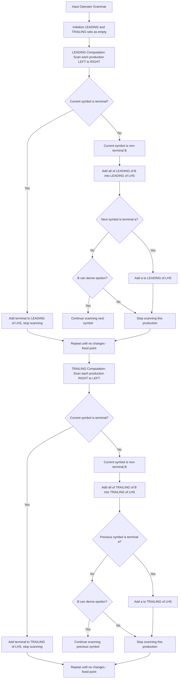

### Operator Precedence Relations

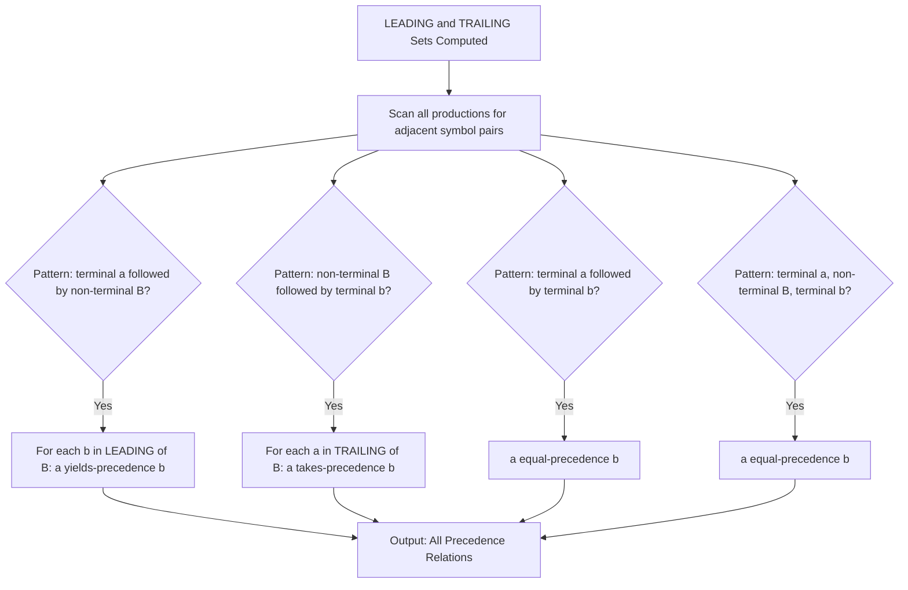

**Example Output:**

```
Non-Terminal    LEADING              TRAILING
E               { (, +, *, id }      { ), +, *, id }
T               { (, *, id }         { ), *, id }
F               { (, id }            { ), id }

Operator a      Relation      Operator b
+               yields        (
*               takes         +
```

---

## How to Run Any Lab

These scripts are built in **pure Python 3** with **zero external dependencies**.

```bash
# 1. Clone the repository
git clone https://github.com/ShivamKSah/ShivamKSah-Compiler-Design-Lab.git
cd ShivamKSah-Compiler-Design-Lab

# 2. Run any lab directly
python "Lab 1 Lexical analyzer/lexical.py"
python "Lab 2 conversion from Regular Expression to NFA/Re_to_nfa.py"
python "Lab 3 Conversion from NFA to DFA/Nfa-dfa.py"
python "Lab 4 Elimation of Ambiguity, Left Recursion and Left Factoring/Lftrecursion.py"
python "Lab 5 -FIRST AND FOLLOW computation/First-follow-func.py"
python "Lab 6 Predictive Parsing Table/Parsetable.py"
python "Lab 7 - Shift Reduce Parsing/Shiftreduce.py"
python "Lab 8- Computation of LEADING AND TRAILING/lead&trailing.py"
```

**Requirements:** Python 3.6+

---

## Overall Compiler Flow

This repository maps directly to the stages of a modern compiler front-end:

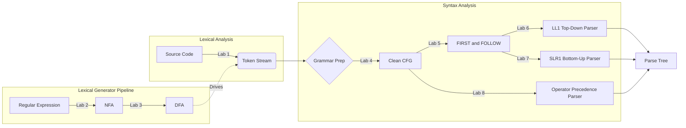

---

<div align="center">

Built with love by **Shivam Kumar Sah** for Compiler Design

</div>
