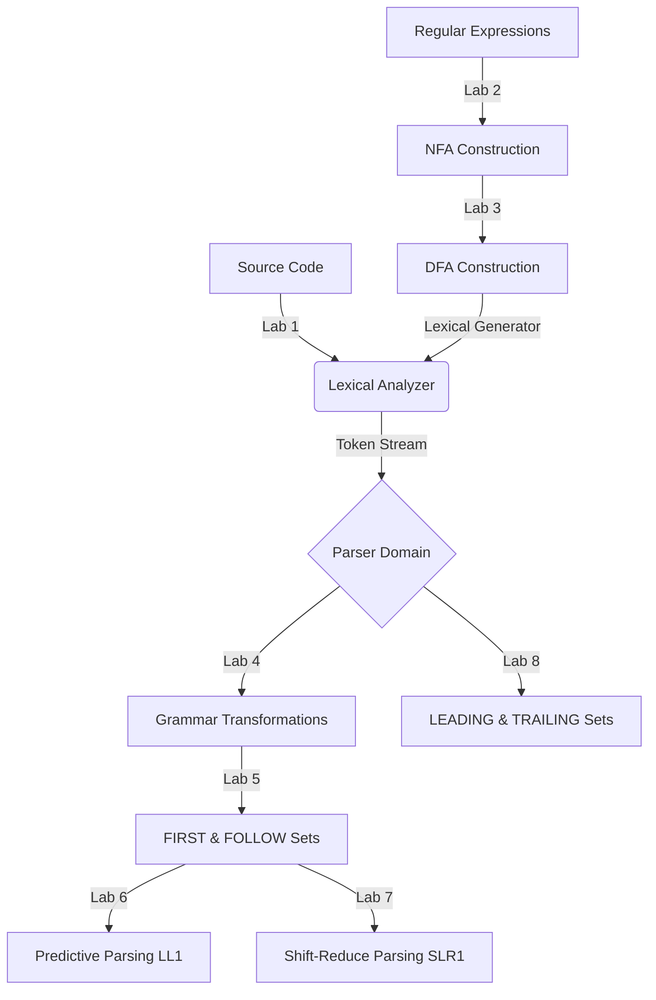

<h1 align="center"> Compiler Design Lab</h1>

<div align="center">
  <p><strong>A complete implementation of core Compiler Design concepts in Python.</strong></p>
  <p><i>Covering all phases from Lexical Analysis to Advanced Parsing techniques.</i></p>
  
  <a href="https://github.com/ShivamKSah/ShivamKSah-Compiler-Design-Lab">
    
  </a>
  <a href="https://github.com/ShivamKSah/ShivamKSah-Compiler-Design-Lab/commits/master">
    
  </a>
  
</div>

<br />

##  Table of Contents

- [ Repository Structure](#-repository-structure)
- [ Lab Summary](#-lab-summary)
  - [Lab 1 — Lexical Analyzer](#lab-1--lexical-analyzer)
  - [Lab 2 — Regular Expression to NFA](#lab-2--regular-expression-to-nfa)
  - [Lab 3 — NFA to DFA](#lab-3--nfa-to-dfa)
  - [Lab 4 — Elimination of Ambiguity & Left Recursion](#lab-4--elimination-of-ambiguity-left-recursion-and-left-factoring)
  - [Lab 5 — FIRST & FOLLOW Computation](#lab-5--first-and-follow-sets)
  - [Lab 6 — Predictive Parsing Table (LL1)](#lab-6--predictive-parsing-table-ll1)
  - [Lab 7 — Shift Reduce Parsing (SLR1)](#lab-7--shift-reduce-parsing-slr1)
  - [Lab 8 — LEADING & TRAILING Sets](#lab-8--leading-and-trailing-sets)
- [ How to Run Any Lab](#-how-to-run-any-lab)
- [ Concept Flow](#-concept-flow)

---

##  Repository Structure

```text
COMPILER-DESIGN-LAB/
 Lab 1 Lexical analyzer/
    lexical.py
    Readme.md
 Lab 2 conversion from Regular Expression to NFA/
    Re_to_nfa.py
    Readme.md
 Lab 3 Conversion from NFA to DFA/
    Nfa_dfa.py
    Readme.md
 Lab 4 Elimation of Ambiguity, Left Recursion and Left Factoring/
    Lftrecursion.py
    Readme.md
 Lab 5 -FIRST AND FOLLOW computation/
    First-follow-func.py
    Readme.md
 Lab 6 Predictive Parsing Table/
    Parsetable.py
    Readme.md
 Lab 7 - Shift Reduce Parsing/
    Shiftreduce.py
    Readme.md
 Lab 8- Computation of LEADING AND TRAILING/
    lead&trailing.py
    Readme.md
 README.md
```

---

##  Lab Summary

### Lab 1 — Lexical Analyzer
**Status:**  Completed | **File:** `lexical.py`

The first phase of a compiler. Reads raw source code and breaks it into a stream of **tokens** — the smallest meaningful units of a program.
- **Recognizes:** Keywords, Identifiers, Integers, Floats, Operators, Delimiters, and Strings.
- Built using Python's `re` (regex) module with a master pattern.
- Skips whitespace and flags unknown or invalid tokens.

### Lab 2 — Regular Expression to NFA
**Status:**  Completed | **File:** `Re_to_nfa.py`

Converts a Regular Expression into a **Non-deterministic Finite Automaton (NFA)** using **Thompson's Construction Algorithm**.
- **Supports:** literals, concatenation, union `|`, Kleene star `*`, `+`, `?`, parentheses.
- Builds an NFA incrementally by combining smaller NFAs.
- Prints all automaton states and ε-transitions clearly.

### Lab 3 — NFA to DFA
**Status:**  Completed | **File:** `Nfa_dfa.py`

Converts an NFA to an equivalent **Deterministic Finite Automaton (DFA)** using the **Subset Construction (Powerset) Algorithm**.
- Computes ε-closure and state movement operations.
- Each DFA state represents a subset of NFA states.
- Simulates the resulting DFA on input strings (accept/reject output).
- Prints the full transition table for both NFA and DFA.

### Lab 4 — Elimination of Ambiguity, Left Recursion and Left Factoring
**Status:**  Completed | **File:** `Lftrecursion.py`

Prepares a Context-Free Grammar (CFG) for parsing by applying three essential grammar transformations:
1. **Ambiguity Elimination:** Restructures grammars to remove multiple valid parse trees (e.g., dangling-else).
2. **Left Recursion Elimination:** Transforms direct left recursion (`A -> Aα`) using the standard `A -> βA'`, `A' -> αA' | ε` rules.
3. **Left Factoring:** Detects common prefixes in productions and factors them out so parsers can decide with single lookahead.

### Lab 5 — FIRST and FOLLOW Sets
**Status:**  Completed | **File:** `First-follow-func.py`

Computes **FIRST** and **FOLLOW** sets for all non-terminals, laying the foundation for building LL(1) parsing tables.
- **FIRST(A):** Terminals that can start a derivation from A (handles ε-propagation).
- **FOLLOW(A):** Terminals that can appear immediately after A in any sentential form.
- Includes an **interactive mode** — enter any grammar and instantly receive the mathematical sets!

### Lab 6 — Predictive Parsing Table (LL1)
**Status:**  Completed | **File:** `Parsetable.py`

Constructs the **LL(1) Predictive Parsing Table** and simulates Top-Down parsing.
- Automatically builds FIRST and FOLLOW sets internally.
- Fills the parsing table using standard LL(1) grammar rules.
- Detects and cleanly reports **conflicts** (when a grammar is not LL(1)).
- Simulates **stack-based LL(1) parsing** with an interactive step-by-step trace output.

### Lab 7 — Shift Reduce Parsing (SLR1)
**Status:**  Completed | **File:** `Shiftreduce.py`

Implements a full **SLR(1) Bottom-Up parser** by building the LR(0) automaton, constructing the parsing table, and simulating the parsing execution.
- Augments the given grammar with an `S' -> S` rule.
- Builds **LR(0) item sets** utilizing closure and goto operations.
- Fills **ACTION** (shift/reduce/accept) and **GOTO** tables referencing FOLLOW sets.
- Simulates shift-reduce parsing with a full stack trace and detects S/R or R/R conflicts.

### Lab 8 — LEADING and TRAILING Sets
**Status:**  Completed | **File:** `lead&trailing.py`

Computes **LEADING** and **TRAILING** sets for Operator Grammars, and derives **Operator Precedence Relations**.
- **LEADING(A):** Terminals that can appear as the leftmost terminal in derivations of A.
- **TRAILING(A):** Terminals that can appear as the rightmost terminal in derivations of A.
- Generates the three precedence relations (`Yields `, `Equal `, `Takes `) between operators dynamically.

---

##  How to Run Any Lab

These scripts are built natively in **pure Python 3**. There are absolutely no external dependencies or pip installations required!

```bash
# 1. Clone the repository
git clone https://github.com/ShivamKSah/ShivamKSah-Compiler-Design-Lab.git
cd ShivamKSah-Compiler-Design-Lab

# 2. Run any lab directly using python
python "Lab 1 Lexical analyzer/lexical.py"
python "Lab 2 conversion from Regular Expression to NFA/Re_to_nfa.py"
python "Lab 3 Conversion from NFA to DFA/Nfa_dfa.py"
python "Lab 5 -FIRST AND FOLLOW computation/First-follow-func.py"
# ... and so on for the others!
```

**Requirements:** `Python 3.6+`

---

##  Concept Flow

This repository maps directly to the stages of a modern compiler architecture:



---
<div align="center">
  <sub>Built with  by <b>Shivam Kumar Sah</b> for Compiler Design</sub>
</div>
